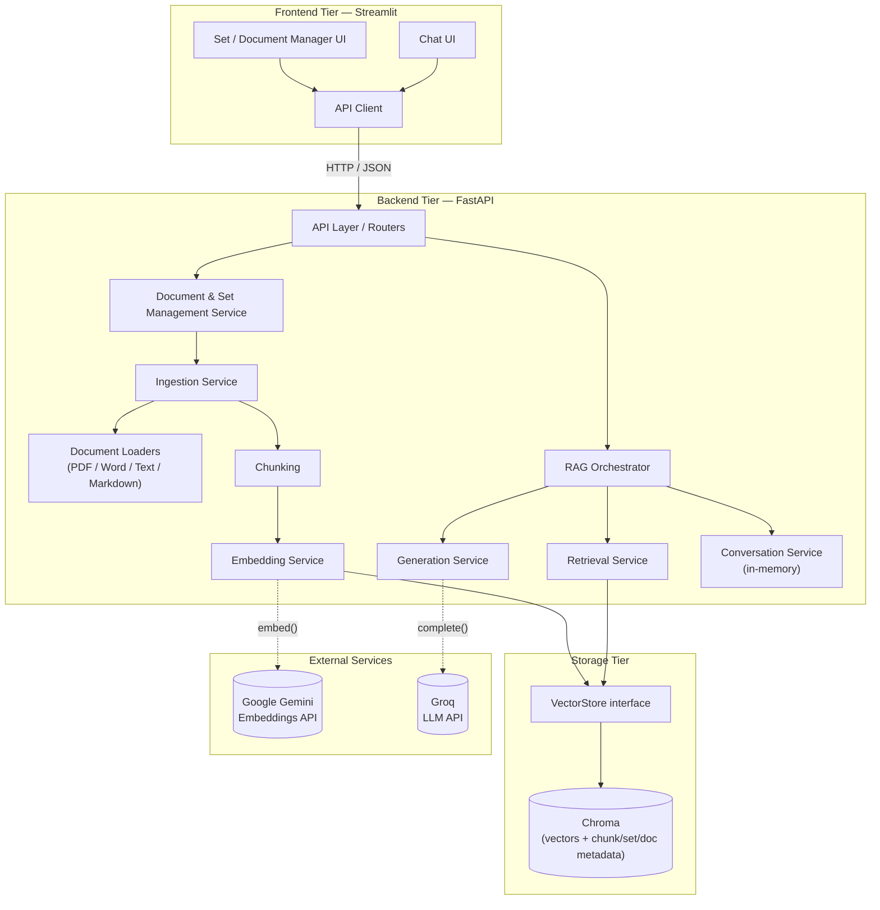
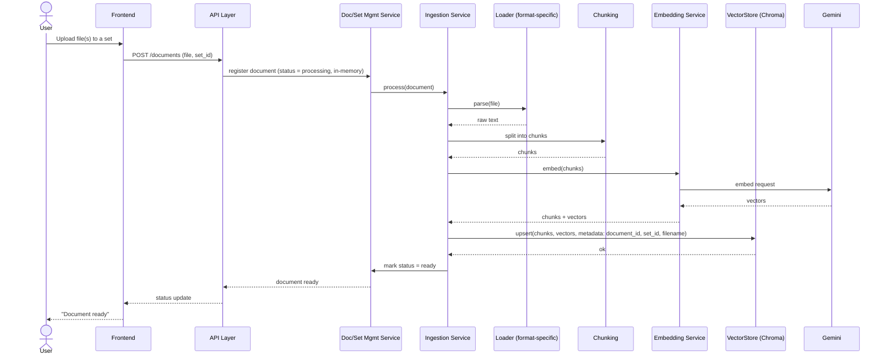
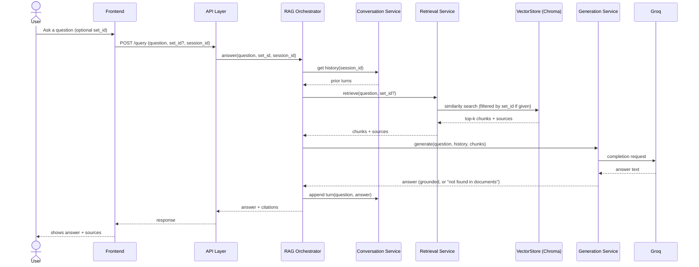

# Architecture

This document is the working model of the application: module boundaries,
how they interact, and why they're split the way they are. See
[`tech-stack.md`](tech-stack.md) for technology choices and rationale, and
[`../specs/001-rag-generator-requirements.md`](../specs/001-rag-generator-requirements.md)
for the requirements this design satisfies.

## Guiding Principles

- **Tiers talk through interfaces, not internals.** Frontend never touches
  Chroma or an LLM API directly — it only ever calls the backend's API.
  Backend services depend on small interfaces (e.g. "a vector store," "a
  document loader") rather than reaching into each other's internals. This
  is what lets any tier be pulled into its own deployable service later
  without a rewrite.
- **New document formats are additive, not invasive.** Per the requirements
  (spec B8.14), adding support for a new format must not require touching
  the code for formats already supported. This is solved with one loader
  class per format behind a shared interface (see *Document Loaders*
  below) — adding PowerPoint later means adding one new class and
  registering it, nothing else changes.
- **No dependency beyond what's needed.** Set/document bookkeeping (which
  documents belong to which set, filenames, status) is kept as metadata
  inside Chroma rather than introducing a second database. In-flight
  ingestion status and conversation history live in backend process memory
  — acceptable because this is a single-user, no-accounts tool (spec
  "Who Uses This"), and both are things the user can simply redo if the
  backend restarts (re-upload a document; start a new chat turn).

## Tier Mapping

- `project/backend/` — FastAPI app; the LlamaIndex-based pipeline
  (ingestion, chunking, retrieval, prompting); the Groq and Gemini client
  wrappers.
- `project/storage/` — Chroma persistence, accessed only through a
  `VectorStore` interface (see below).
- `project/frontend/` — Streamlit app; talks to the backend only over
  HTTP, through a single API client module.

---

## Backend Modules

| Module | Responsibility |
|---|---|
| **API Layer** | FastAPI routers. Thin — translates HTTP requests to service calls and service results back to HTTP responses. No business logic lives here. |
| **Document & Set Management Service** | Create/list/delete sets; add/remove documents in a set; list documents and their status. The thing the API layer calls for anything that isn't a question. |
| **Ingestion Service** | Orchestrates turning an uploaded file into searchable chunks: calls the right Loader, then Chunking, then Embedding, then writes to the VectorStore. |
| **Document Loaders** | One class per format (PDF, Word, plain text, Markdown), each implementing a shared `DocumentLoader` interface (`parse(file) -> raw text`). Selected by a registry keyed on file extension/type. This is the extension point for new formats. |
| **Chunking** | Splits raw document text into retrievable chunks (LlamaIndex node parsing). |
| **Embedding Service** | Wraps Gemini embedding calls; turns chunks into vectors. |
| **Retrieval Service** | Wraps Chroma similarity search through the `VectorStore` interface; supports "search everything" or "scoped to one set" (metadata filter on `set_id`). |
| **Generation Service** | Wraps Groq LLM calls; builds the prompt from the question, retrieved chunks, and conversation history; decides when there isn't enough grounding to answer. |
| **Conversation Service** | Holds multi-turn history per session, in memory, keyed by session id. |
| **RAG Orchestrator** | The use-case coordinator for "answer a question": pulls history from Conversation Service, retrieved chunks from Retrieval Service, calls Generation Service, attaches citations, and hands the result back to the API layer. Retrieval, Generation, and Conversation don't know about each other — only the orchestrator does. |
| **Config** | Loads settings/API keys from environment variables in one place; injected into the services that need them, never read ad hoc. |

## Storage Tier

- A `VectorStore` interface is the only thing the backend depends on for
  persistence (`upsert(chunks, vectors, metadata)`, `query(vector, filter)`,
  `delete(document_id)`, etc.). Today it has one implementation, backed by
  Chroma.
- Document and set bookkeeping is **not** a separate database. Every chunk
  written to Chroma carries metadata: `document_id`, `set_id`, `filename`,
  `format`, `uploaded_at`. Listing "documents in a set" or "all sets" is a
  metadata query against Chroma, not a second source of truth to keep in
  sync.
- In-flight ingestion status (`processing` / `ready` / `error`) lives in
  backend memory only. A document only exists in Chroma once it's fully
  processed, so there's nothing to reconcile after a crash — the document
  simply isn't there yet, and the user re-uploads.
- This keeps the storage tier exactly as originally scoped (Chroma only)
  and avoids a second dependency, at the cost of the backend being the
  only thing that can serve "list documents" queries quickly (acceptable —
  nothing else needs that data).

## Frontend Modules

| Module | Responsibility |
|---|---|
| **API Client** | The only module that speaks HTTP to the backend. Every other frontend module goes through it — nothing else knows the backend's URL or request/response shapes. |
| **Set & Document Manager (UI)** | Create/select sets, upload documents, show status, remove documents. |
| **Chat (UI)** | Set selector (optional — default is "search everything," per spec A2.8), message history, question input, answer + citations display, explicit "not found in documents" state. |
| **Session State** | Streamlit's own session state, holding the current session id and set selection — not conversation history itself, which the backend owns. |

## Design Patterns in Use

- **Strategy pattern — Document Loaders.** One interface, one implementation
  per format. Satisfies the "add formats without touching existing ones"
  requirement directly.
- **Adapter/Repository pattern — `VectorStore`.** Backend code depends on
  the interface, not on Chroma specifically, so the storage tier can be
  swapped or split into its own service later.
- **Service layer.** FastAPI routers stay thin and are not where logic
  lives, which makes the services independently unit-testable without
  spinning up HTTP.
- **Orchestrator pattern — RAG query flow.** The orchestrator is the only
  module that knows the full sequence of a question being answered;
  Retrieval, Generation, and Conversation stay decoupled from each other.

---

## Data Flow

### Component Overview

### Sequence: Document Ingestion

### Sequence: Question Answering

---

## Open Items

- Exact API endpoint/route design (paths, request/response schemas) — to
  be worked out when the backend is scaffolded, not before.
- Top-k retrieval count, chunk size/overlap, and prompt template — tuning
  decisions to make once there's a working pipeline to test against.
