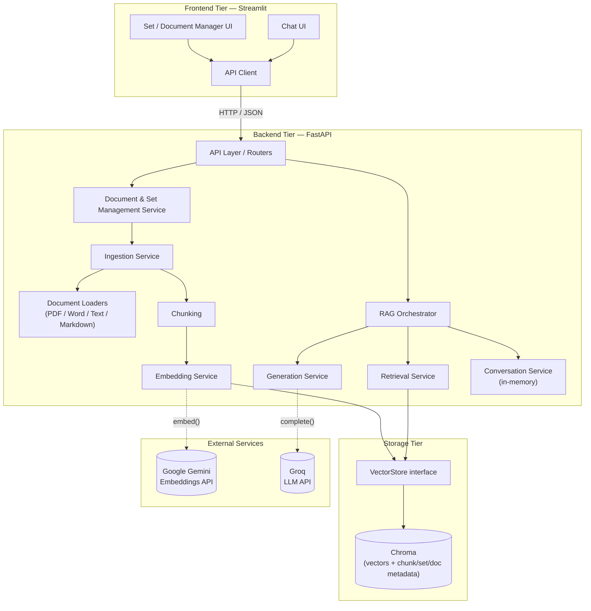
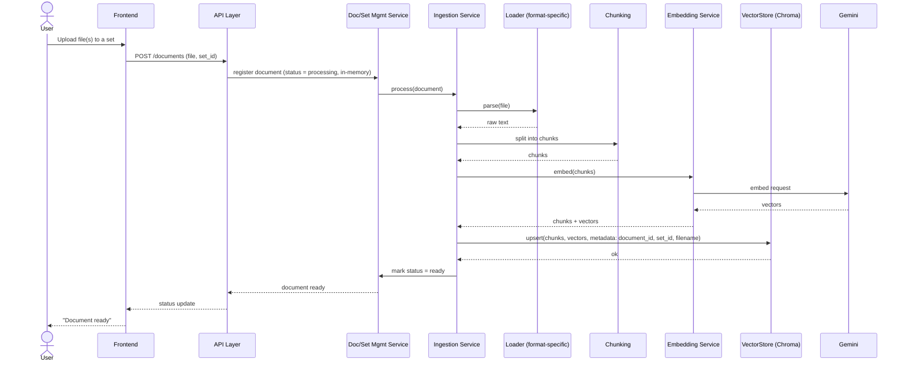
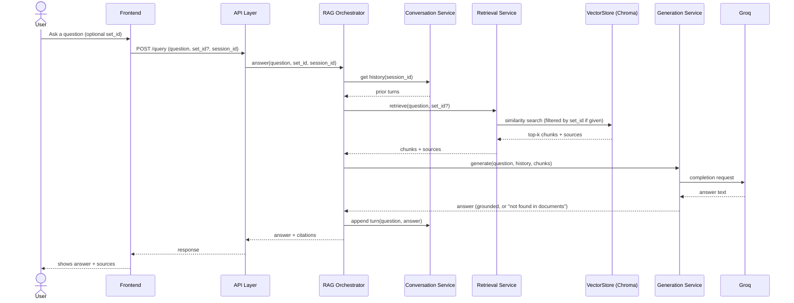
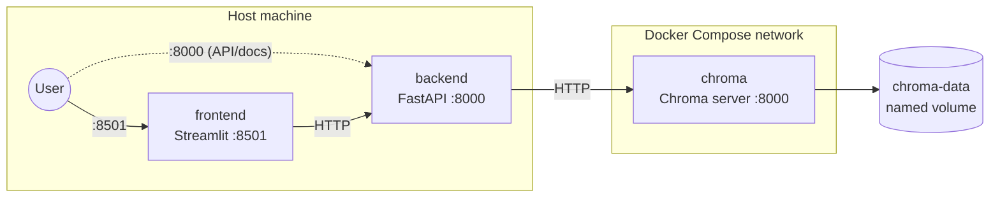

# Architecture

This document is the **central architecture document** — the working model
of the application and the entry point for understanding how it's
designed: module boundaries, how they interact, and why they're split the
way they are. See
[`tech-stack.md`](tech-stack.md) for technology choices and rationale, and
[`../specs/001-rag-generator-requirements.md`](../specs/001-rag-generator-requirements.md)
for the requirements this design satisfies.

Deeper design documents that drill into a single tier or concern live
alongside this file and are referenced from here rather than folded in
directly, so this document stays a readable overview:

- [`backend-low-level-design.md`](backend-low-level-design.md) — class-level
  design for the backend tier (UML class diagrams), building on the module
  boundaries below. Expected to evolve as implementation proceeds.

## Guiding Principles

- **Tiers talk through interfaces, not internals.** Frontend never touches
  Chroma or an LLM API directly — it only ever calls the backend's API.
  Backend services depend on small interfaces (e.g. "a vector store," "a
  document loader") rather than reaching into each other's internals. This
  is what lets any tier be pulled into its own deployable service later
  without a rewrite.
- **New document formats are additive, not invasive.** Per the requirements
  (spec B8.14), adding support for a new format must not require touching
  the code for formats already supported. This is solved with one loader
  class per format behind a shared interface (see *Document Loaders*
  below) — adding PowerPoint later means adding one new class and
  registering it, nothing else changes.
- **No dependency beyond what's needed.** There is no second database. Chroma
  holds chunks, embeddings and per-chunk metadata; set/document bookkeeping
  (which documents belong to which set, filenames, status), ingestion status
  and conversation history live in backend process memory — acceptable
  because this is a single-user, no-accounts tool (spec "Who Uses This"),
  and all of it is something the user can simply redo after a restart
  (re-create sets, re-upload, start a new chat). *Amended in Phase 4:* this
  originally said set/document bookkeeping would be derived from Chroma
  metadata; that was dropped — see *Storage Tier* and *Known Consequence*
  below.

## Tier Mapping

- `project/backend/` — FastAPI app; the LlamaIndex-based pipeline
  (ingestion, chunking, retrieval, prompting); the Groq and Gemini client
  wrappers.
- `project/storage/` — Chroma persistence, accessed only through a
  `VectorStore` interface (see below).
- `project/frontend/` — Streamlit app; talks to the backend only over
  HTTP, through a single API client module.

---

## Backend Modules

| Module | Responsibility |
|---|---|
| **API Layer** | FastAPI routers. Thin — translates HTTP requests to service calls and service results back to HTTP responses. No business logic lives here. |
| **Document & Set Management Service** | Create/list/delete sets; add/remove documents in a set; list documents and their status. The thing the API layer calls for anything that isn't a question. |
| **Ingestion Service** | Orchestrates turning an uploaded file into searchable chunks: calls the right Loader, then Chunking, then Embedding, then writes to the VectorStore. |
| **Document Loaders** | One class per format (PDF, Word, plain text, Markdown), each implementing a shared `DocumentLoader` interface (`parse(file) -> raw text`). Selected by a registry keyed on file extension/type. This is the extension point for new formats. |
| **Chunking** | Splits raw document text into retrievable chunks (LlamaIndex node parsing). |
| **Embedding Service** | Wraps Gemini embedding calls; turns chunks into vectors. |
| **Retrieval Service** | Wraps Chroma similarity search through the `VectorStore` interface; supports "search everything" or "scoped to one set" (metadata filter on `set_id`). |
| **Generation Service** | Wraps Groq LLM calls; builds the prompt from the question, retrieved chunks, and conversation history; decides when there isn't enough grounding to answer. |
| **Conversation Service** | Holds multi-turn history per session, in memory, keyed by session id. |
| **RAG Orchestrator** | The use-case coordinator for "answer a question": pulls history from Conversation Service, retrieved chunks from Retrieval Service, calls Generation Service, attaches citations, and hands the result back to the API layer. Retrieval, Generation, and Conversation don't know about each other — only the orchestrator does. |
| **Config** | Loads settings/API keys from environment variables in one place; injected into the services that need them, never read ad hoc. |

## Storage Tier

- A `VectorStore` interface is the only thing the backend depends on for
  persistence (`upsert(chunks, vectors, metadata)`, `query(vector, filter)`,
  `delete(document_id)`, etc.). It has two implementations, both backed by
  Chroma, selected at startup by config (`backend/api/dependencies.py`):
  - `ChromaVectorStore` — Chroma embedded as a local library
    (`PersistentClient`), used for local (non-Docker) development.
  - `ChromaHttpVectorStore` — Chroma running as its own server, reached
    over HTTP (`HttpClient`), used in the Docker Compose deployment (see
    [`../docker/`](../docker/) and
    [`../specs/012-containerization.md`](../specs/012-containerization.md)).
  Both share their upsert/query/delete logic
  (`storage/_chroma_collection.py`) and differ only in how they obtain a
  `chromadb` client — this is the "swapped or split into its own service
  later" case the `VectorStore` interface was deliberately designed for
  (see *Design Patterns* below), now exercised for real.
- Document and set bookkeeping is **not** a separate database, and it is
  **not stored in Chroma either**. `DocumentSetService` keeps sets,
  documents (id, name, status, content hash, set membership) in backend
  memory. This was decided in Phase 4 (spec 006): an empty, just-created set
  has no chunks, so there is nothing in Chroma to derive it from. Chroma
  remains the source of truth for chunks and vectors only. Every chunk still
  carries metadata (`document_id`, `set_id`, `filename`, `format`,
  `uploaded_at`), which is what set-scoped retrieval filters on.
- Ingestion status (`processing` / `ready` / `error`) is also memory-only.
  A document's chunks are only written to Chroma once it is fully processed
  (embedding failure leaves nothing behind), so there is nothing to
  reconcile after a crash — the user re-uploads.
- **Known consequence (unresolved, see `ABOUT.md` §5.1/§6):** the registry
  is volatile but Chroma's data is not (named volume under Docker; a
  directory locally). After a backend restart the UI lists no sets or
  documents, yet previously stored vectors remain and are still returned by
  unscoped ("search everything") retrieval; the UI cannot remove them.
  Workaround: purge the volume (`./docker/rag.sh down --purge`). Fixing it
  is an open design decision (persist the registry, or rebuild it from
  Chroma on startup).
- Re-uploading: a byte-identical file (same filename + SHA-256) in the same
  set is rejected as a duplicate; a same-named file with different content
  replaces the old document — the old document and its vectors are removed
  only after the new one is fully ingested. Removing a document or deleting
  a set deletes its vectors from Chroma.
- This keeps the storage tier exactly as originally scoped (Chroma only)
  and avoids a second dependency, at the cost of the backend being the
  only thing that can serve "list documents" queries quickly (acceptable —
  nothing else needs that data).

## Frontend Modules

| Module | Responsibility |
|---|---|
| **API Client** | The only module that speaks HTTP to the backend. Every other frontend module goes through it — nothing else knows the backend's URL or request/response shapes. |
| **Landing Page (UI)** | Default page (`/`): hero, "How it works" steps and a "Start With RAG Assessment Project" call to action that navigates to the Set & Document Manager. Sidebar is hidden here; the sidebar only carries branding and navigation. |
| **Set & Document Manager (UI)** | Create/select sets, upload documents, show status, remove documents. |
| **Chat (UI)** | Set selector (optional — default is "search everything," per spec A2.8), message history, question input, suggested starter questions, "New chat" (clears the transcript and rotates the session id), answer + citation badges, explicit "not found in documents" state. |
| **UI Kit (`ui.py`)** | Presentation only: global stylesheet, page header and empty-state components. No API calls or state. Colours live in `.streamlit/config.toml` (`[theme]`); `ui.py` holds only styling the theme keys can't express. |
| **Session State** | Streamlit's own session state, holding the current session id and set selection — not conversation history itself, which the backend owns. |

## Design Patterns in Use

- **Strategy pattern — Document Loaders.** One interface, one implementation
  per format. Satisfies the "add formats without touching existing ones"
  requirement directly.
- **Adapter/Repository pattern — `VectorStore`.** Backend code depends on
  the interface, not on Chroma specifically, so the storage tier can be
  swapped or split into its own service later.
- **Service layer.** FastAPI routers stay thin and are not where logic
  lives, which makes the services independently unit-testable without
  spinning up HTTP.
- **Orchestrator pattern — RAG query flow.** The orchestrator is the only
  module that knows the full sequence of a question being answered;
  Retrieval, Generation, and Conversation stay decoupled from each other.

---

## Data Flow

### Component Overview

### Sequence: Document Ingestion

### Sequence: Question Answering

---

## Deployment (Docker Compose)

Three containers, defined in [`../docker/docker-compose.yml`](../docker/docker-compose.yml):

- `frontend` and `backend` are each built from this repo (`docker/frontend/Dockerfile`,
  `docker/backend/Dockerfile`); `chroma` uses the official `chromadb/chroma`
  image unmodified.
- Only `frontend` (8501) and `backend` (8000) publish ports to the host;
  `chroma` is reachable only from other containers on the compose network —
  nothing outside the deployment talks to it directly, preserving "Frontend
  never touches Chroma... directly" from the Guiding Principles above one
  layer further down.
- Secrets (`GROQ_API_KEY`, `GOOGLE_API_KEY`) still come from the repo-root
  `.env` (via each service's `env_file:`), never baked into an image layer.
  `BACKEND_URL` and `CHROMA_HOST`/`CHROMA_PORT` are overridden per-container
  in the compose file itself, since those need container-network addresses
  (`http://backend:8000`, `chroma`) rather than the localhost addresses
  `.env` uses for local (non-Docker) development.
- All three services have health checks (`chroma`: TCP probe, `backend`:
  `/health`, `frontend`: `/_stcore/health`) and `restart: unless-stopped`.
  `depends_on: condition: service_healthy` orders startup
  chroma → backend → frontend.
- `docker/rag.sh` (`up`, `down`, `down --purge`, `restart`, `status`, `logs`)
  is the supported entry point for running the stack. It preflights Docker
  and `.env`, then delegates to `docker compose up --build -d --wait` /
  `down`; the compose file remains the single source of truth for
  the deployment. It lives in `docker/` with the rest of the container tooling.
- Local (non-Docker) development is unchanged: `CHROMA_HOST` defaults to
  empty, which keeps the backend on the embedded `ChromaVectorStore` exactly
  as before Docker existed. See *Storage Tier* above.

See [`../specs/012-containerization.md`](../specs/012-containerization.md) for
the full record of this decision, including why Chroma was split into its
own container instead of staying embedded.

---

## Implementation Decisions & Defaults

Values and behaviours settled while building. **Origin** says whether the
user chose it (*User*) or it was picked during implementation without review
(*Default* — a proposal, change freely). The plain-language version, with
known limitations, is in [`ABOUT.md`](../ABOUT.md).

| Area | Decision | Origin | Where |
|---|---|---|---|
| Chunking | LlamaIndex `SentenceSplitter`, 512 / overlap 50; empty pieces dropped | Default | `services/chunking_service.py` |
| Retrieval | top-k = 5, cosine distance (`hnsw:space=cosine`), optional `set_id` filter; query text is the raw latest question (no history-based rewriting, no re-ranking) | Default | `rag_orchestrator.py`, `_chroma_collection.py` |
| Prompt | One fixed system prompt: answer only from the numbered context, say so if insufficient; history replayed as chat turns; context blocks tagged with filename | Default | `services/generation_service.py` |
| Grounding | Zero retrieved chunks → fixed "not found" answer, LLM not called (`grounded=false`). Otherwise `grounded=true` and every retrieved chunk is cited; no distance threshold | User (pre-check approach) / Default (no threshold) | `generation_service.py` |
| Generation model | Groq `openai/gpt-oss-120b`, temperature 0 | User (Groq) / Default (model, temp) | `clients/groq_client.py` |
| Embedding model | Gemini `gemini-embedding-001` (replaces `text-embedding-004`, superseded) | User (Gemini) / Default (model) | `clients/gemini_client.py` |
| Rate limits | Gemini: batches of 100, 120 s timeout, 6 attempts, exponential backoff + jitter, max 45 s; Groq: 4 retries. 429/503 surface as a plain rate-limit error | User (backoff + jitter) / Default (numbers) | `clients/*.py` |
| Ingestion | Synchronous request; sequential multi-file upload from the UI; temp file deleted after parsing | User (temp file, multi-upload) / Default (sync) | `document_routes.py`, `set_manager.py` |
| API | Dedicated Pydantic DTOs; synchronous routes; upload errors: 400 unsupported extension, 404 unknown set, 409 identical duplicate, 422 empty/unreadable file, 429 rate-limited (failed documents are marked `error`) | User (DTOs) / Default (rest) | `api/` |
| Duplicates | Same set + same filename + same content → rejected; same filename, new content → replace | User | `document_set_service.py`, `ingestion_service.py` |
| Sessions | One session id per browser tab (Streamlit session state); history in memory, unbounded, never evicted; "New chat" rotates the id | User (in-memory) / Default (rest) | `session_state.py`, `conversation_service.py` |
| Frontend | Multi-page Streamlit (`Home`, `Sets & Documents`, `Chat`), explicit URLs `/`, `/sets`, `/chat`; 300 s client timeout; 10 MB Streamlit upload ceiling that the UI deliberately does not advertise | User (multi-page, independent selector, no size text) / Default (timeout, ceiling) | `frontend/` |
| Config | `pydantic-settings` in backend and frontend; shared repo-root `.env`; backend ignores unknown keys | User | `config.py` |
| Deployment | Compose: chroma → backend → frontend, health-gated; Chroma in its own container pinned to 1.5.9; `docker/rag.sh` entry point | User (containers, Chroma split) / Default (pins, restart policy, script) | `docker/` |

## Open Items

Resolved by the defaults above (to be re-tuned against real documents, not
"undecided"): top-k, chunk size/overlap, prompt template, API endpoint design
(routes: `POST/GET/DELETE /sets`, `POST/GET/DELETE /documents`,
`POST /query`, `GET /health` — see `backend/api/`).

Still open:
- **Restart behaviour** of the in-memory registry vs. persistent vectors
  (see *Storage Tier → Known consequence*).
- A relevance threshold for the "not found" answer.
- Rewriting follow-up questions with conversation history before retrieval.
- History length limit / session eviction.
