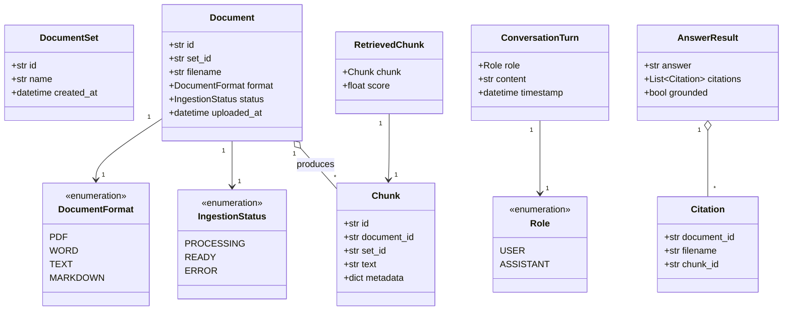
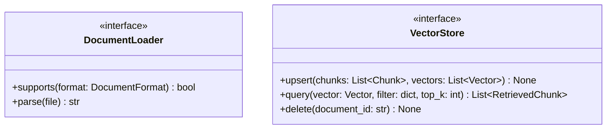
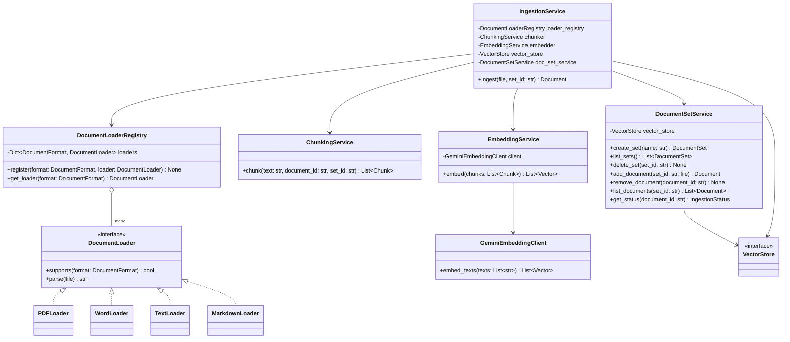
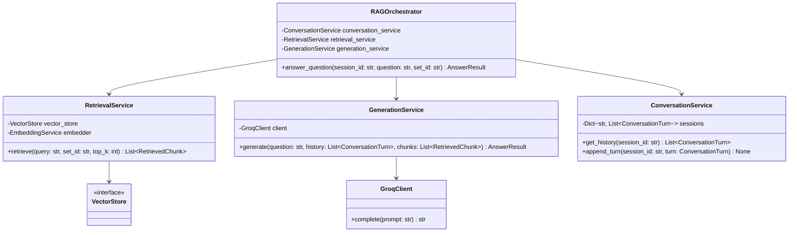
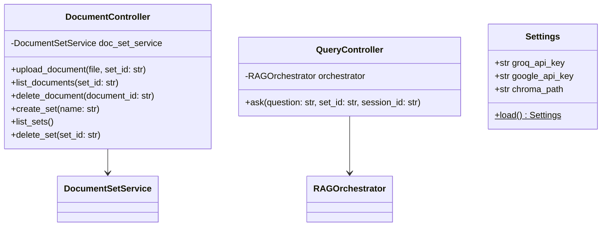

# Backend Low-Level Design — Class Diagrams

This document drills into the backend modules defined in
[`architecture.md`](architecture.md) (the central architecture document —
see it first for the module boundaries, data flow, and design patterns this
file assumes) down to the class level. It is a **starting point, not a
contract**: attributes and method signatures will change as implementation
uncovers real requirements. What should stay stable is the shape —
which classes exist, what they depend on, and which boundaries are
interfaces.

Scope: the **backend tier only**. `VectorStore` appears here as the
interface the backend depends on; its Chroma-backed implementation belongs
to the storage tier and will be detailed when that tier's own phase spec is
written. API request/response DTOs are also out of scope here, per
`architecture.md`'s open item deferring exact endpoint/schema design —
the controllers below show intent and delegation, not final signatures.

---

## Domain Model

The types every service passes around. `Chunk`, `Document`, and
`DocumentSet` mirror the metadata fields already named in `architecture.md`
(`document_id`, `set_id`, `filename`, `format`, `uploaded_at`).

---

## Interfaces (Backend-Side Contracts)

`VectorStore` is implemented today by a Chroma-backed class that lives in
`project/storage/`; the backend only ever imports the interface.

---

## Ingestion Pipeline

Matches the *Strategy pattern* call-out in `architecture.md`: one
`DocumentLoader` implementation per format, selected through a registry so
adding a format never touches existing loader code.

---

## Query / RAG Pipeline

Matches the *Orchestrator pattern* call-out: `RAGOrchestrator` is the only
class aware of the full "answer a question" sequence. `RetrievalService`,
`GenerationService`, and `ConversationService` don't reference each other.

---

## API Layer & Config

Controllers stay thin (*Service layer* pattern) — they translate HTTP to
service calls and back, with no business logic of their own. Shown here to
establish which service each controller depends on; exact routes and
request/response schemas are deferred, as noted in `architecture.md`.

`Settings` (the `Config` module in `architecture.md`) is loaded once at
startup and injected into `GeminiEmbeddingClient`, `GroqClient`, and
whichever storage-tier class constructs the Chroma client — never read ad
hoc from inside a service.

---

## Open Items

- Exact method signatures above are illustrative — parameter/return types
  will firm up once the backend is scaffolded (Phase 1 of
  `specs/002-master-development-plan.md`) and real framework types (e.g.
  FastAPI's `UploadFile`, LlamaIndex node types) are in play.
- API request/response DTOs, error/exception hierarchy, and pagination for
  list endpoints are not designed yet — deferred to the phase(s) that build
  the API layer and ingestion pipeline.
- Whether `EmbeddingService` is shared by reference between
  `IngestionService` and `RetrievalService` (single instance) or
  constructed separately is an implementation detail to settle during
  Phase 1 dependency wiring, not a design constraint here.
